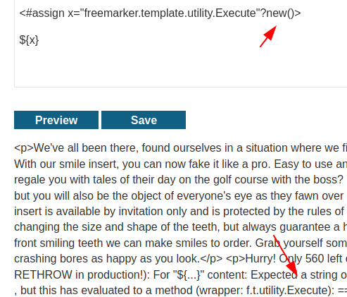

# Lab 3 - Server Side Template Injection


In this lab we need to find a flaw using the docs of an template engine itself.


First we can provoke a error and figure out what template engine is behind:


So, it's a template for Java applications, Freemarker.


In this template engine there is a [execute](https://freemarker.apache.org/docs/api/freemarker/template/utility/Execute.html) call, we must find a way to load this and try to execute something in the server.

After read the basic of Freemarker templating, I found the ***assign*** keyword, that let us to assign some variable, after researching a lot I found a doc about builtin types, and the ***new*** keyword in Freemarker context [here](https://freemarker.apache.org/docs/ref_builtins_expert.html#ref_builtin_new).


Brief:
```
new

This is to create a variable of a certain TemplateModel implementation.

On the left side of ? you specify a string, the full-qualified class name of a TemplateModel implementation. The result is a method variable that calls the constructor, and returns the new variable.

Example:

<#-- Creates an user-defined directive be calling the parameterless constructor of the class -->
<#assign word_wrapp = "com.acmee.freemarker.WordWrapperDirective"?new()>
<#-- Creates an user-defined directive be calling the constructor with one numerical argument -->
<#assign word_wrapp_narrow = "com.acmee.freemarker.WordWrapperDirective"?new(40)>
```

So we can create any object that implements TemplateModel interface, the Execute object implement this, so we must be able to create this object in runtime.


I was able to provoke a error, I tried to access the ***exec*** method inside the new keyword, but this was totally wrong because in Freemarker the ***dot*** operator is only for hash tables types, and also my new was wrong, because I forgotten the parenthesis ***()***, here is the correct way:




So now I have a instance of Execute object, with this we just need go further in the assign line and try execute something calling ***new()("command")***


This works because the ***exec*** is a instance method, and we don't need a directly call this.

### Beating


And that is it, was very cool to do that one


