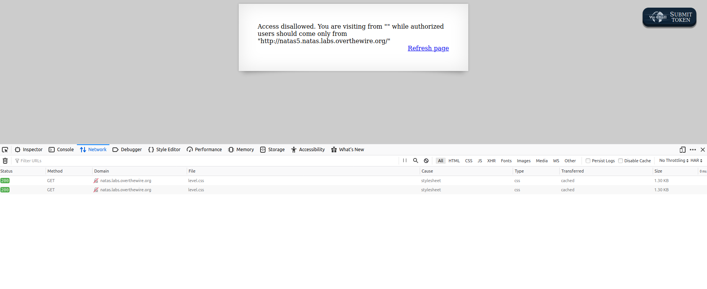
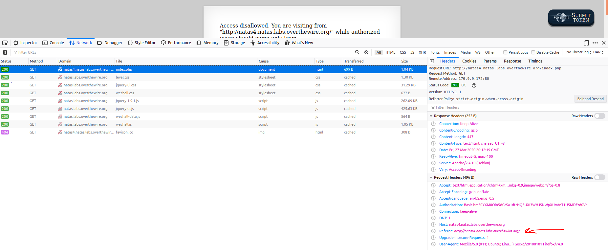

# Natas 04


That one is cool, the website claims that you must only come from "http://natas5.natas.labs.overthewire.org/", for that one we will use some tools and the browser itself (just for understand the idea behind it).

An HTTP headers is a series of keys and values, each one has a function inside the server/application, for this challenge we can assume that the server know from which website we are coming, but how is this possible ?

### Referer header


The definition is simple, this request header contains the previous web page which a link to the currently requested page was followed, take a look at [here](https://developer.mozilla.org/en-US/docs/Web/HTTP/Headers/Referer), so to solve this one, you just need to modify the HTTP request and add a fake referer value :) 

You can use a lot of tools to solve that, Curl, Burp, Zaproxy, developer tools or even code yourself one, but the simplist way is to use the browser itself.


### Beating with firefox

Almost every http manipulation i do is using firefox itself, i like that because its very straightforward and easy. In order to solve that one, open the developer tools (F12) and go to Network tab.



Now, you need to capture the request you want to modify, just hit the refresh ```Refresh page``` link, this will refresh the website and you be able to see the referer header here.




Now just go in ```Edit and Resend``` and change the referer value to ```http://natas5.natas.labs.overthewire.org/``` and hit **Send**, take a look in the the response of the next request, and your password is in there :)


#### And about Burp Suite & Zaproxy ?


The two are great tools, but its like you go hunt cockroaches with a shotgun, if you know what i mean :) 

The password to natas5: iX6IOfmpN7AYOQGPwtn3fXpbaJVJcHfq 