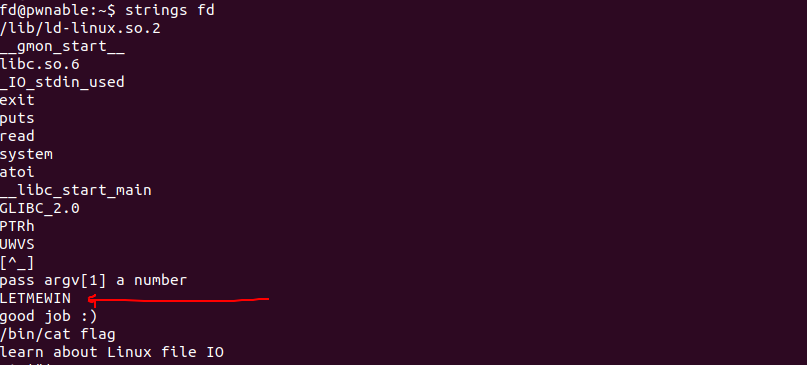

### FD - File descriptor


This is the first challenge of pwnable, and its explores the concepts of [file descriptors](https://www.bottomupcs.com/file_descriptors.xhtml).


## Workflow

When you first arrive in the server, you will notice three files, fd, fd.c and flag, this will not be readable for you, the ELF file has an [SUID](https://en.wikipedia.org/wiki/Setuid) flag that will allow you to read the flag(the file) after the challenge.

**please don't read the source yet**, the first execution you will notice that the program itself will ask you for a number.


## Disassembly 

After you read the idea behind [file descriptors](https://www.bottomupcs.com/file_descriptors.xhtml), you are ready to continue to this. I will not open any debugger (because its not necessary to this challenge), just the good and old **objdump**

```
objdump -DM intel fd | less
```
The arguments:

- -D: Dissasembly everything
- -M: Dissasembly options, enable Intel syntax


Inside the less command, filter to find the symbol main using 
    ```
        /<main>:
    ```

### Understanding the trick


The function ```atoi()``` gets an ```const char*``` as an argument and transforms into a integer value, we can deduce that this value is actually our input, and after our input transformed in an integer, a sub instruction is made with **our number minus 0x1234** (second arrow).

Now you can see that our value in the EAX register has be decressed from 0x1234, now take an look in the [read](http://man7.org/linux/man-pages/man2/read.2.html) call, this function will receive the content of the EAX register, in other words, our input will be subtracted from 0x1234 and the result will be passed to the read function!

### Beating up the challenge

When you realize that, its easy, we just need to pass an number that subtracted from 0x1234 will give us a valid file descriptor! for this, we will be using stdin (number 0), so we just need to pass the 0x1234 value itself!


Ok, we get the stdin input, and now we are able to send data to the program, good! but what do we need to send ? 

I literally run the ```strings``` command, and tried to find something usefull, and i found :)



And then...


Here is :)


### Final thoughts

This is a very simple pwn challenge, but its very useful to undestand basic concepts inside an unix system!

Thanks
